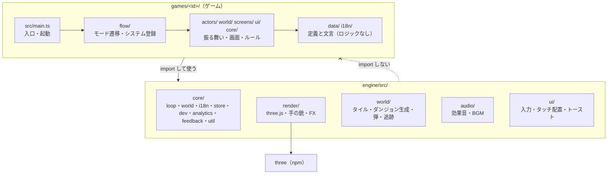
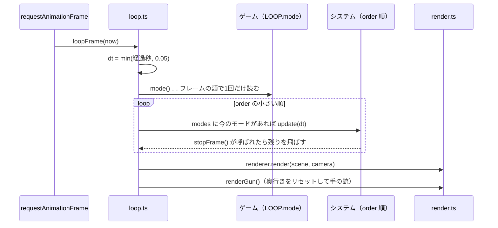
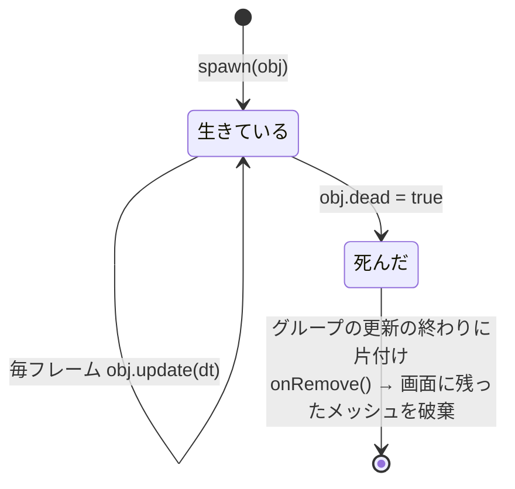
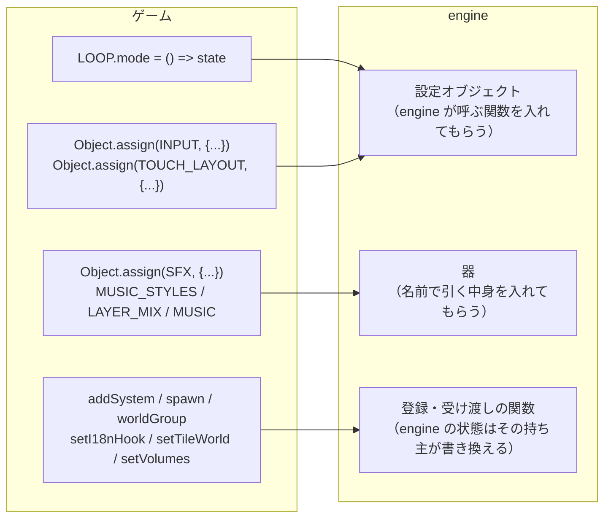
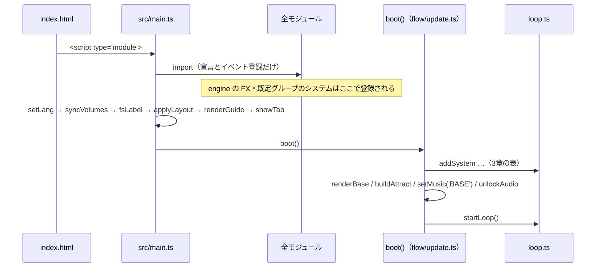

# engine の全体像

engine がどういう考え方で組まれているかをまとめる。関数の一覧は [README.md](README.md)、細かい規則は [SPEC.md](SPEC.md) にある。先にこれを読んでから、必要なところだけそちらを引く想定。

## 1. ひとことで言うと

**engine は「毎フレーム、登録された処理を決まった順番で呼んで、画面を描く」だけの土台。何を動かすかはゲームが登録する。**

Unity に例えると次のようになる。

| Unity | この engine | どこ |
|---|---|---|
| Player Loop | `loop.ts` のメインループ | `core/loop.ts` |
| Script Execution Order | システムの `order` | `addSystem({ order })` |
| MonoBehaviour の `Update()` | world のオブジェクトの `update(dt)` | `core/world.ts` の `spawn` |
| `Destroy()` | `obj.dead = true` | 更新の終わりにまとめて片付く |
| シーンの切り替え | モード（`'play'`, `'base'` など） | `LOOP.mode()` |
| Inspector で入れる設定 | 設定オブジェクト（`INPUT` など）と、ゲームが中身を入れる器（`SFX` など） | 各モジュール |

守っている約束は3つ。

1. **engine はゲームを import しない。** ゲームの事情は、設定オブジェクト・登録関数・器を通して受け取る（5章）
2. **動くものはすべて「システム」か「world のオブジェクト」。** 毎フレームの処理をループの外に置かない（3章・4章）
3. **読み込み時は宣言だけにする。** 起動処理は入口の `src/main.ts` が全部を読み込んだあとに呼ぶ（6章）

## 2. 層の構成

- 上から下へだけ依存する。engine の中でも `core/` がいちばん下（`render/fx.ts` と `core/world.ts` は `core/loop.ts` にシステムを登録する）
- ゲームの中では、`data/` と `i18n/` は値だけを持つ。数値や文言を変えるときにロジックを触らなくて済む

## 3. 1フレームの流れ

- **dt の頭打ち（0.05秒）**: タブが裏にいたあとなどで、1フレームに大きく進みすぎないようにしている
- **モードはフレームの頭で固定**: 途中でモードが変わっても、そのフレームの残りは元のモードで進む。区画を移った直後など、残りを走らせたくないときは `stopFrame()`

### 例: Sector Dive のシステムの並び

`games/sector-dive/src/flow/update.ts` の `boot()` で登録している。エンジンが自分で登録するもの（world のグループ、FX）も同じ列に並ぶ。

| order | システム | 動くモード | 登録元 |
|---:|---|---|---|
| 0 | player（移動・射撃・カメラ） | play | ゲーム |
| 0 | attract（拠点画面の背景） | base | ゲーム |
| 10 | world:enemy（敵ひとりずつ `update`） | play | engine のグループ（ゲームが `worldGroup('enemy', 10)`） |
| 20 / 21 | 自弾 / 敵弾 | play | ゲーム |
| 29 | pickupReset（「いちばん近い武器」を選び直す） | play | ゲーム |
| 30 | world:*（拾える物・衝撃波など、その他のオブジェクト） | play | engine の既定グループ |
| 40 / 41 | 爆発の光 / パーティクル | play / play・base | engine（`FX`） |
| 50 | hazards（床の危険地帯） | play | ゲーム |
| 60 | music（戦闘かどうかで BGM の層を切り替える） | play | ゲーム |
| 65 | endGuard（ランが終わったらこのフレームを止める） | play | ゲーム |
| 70 | portals | play | ゲーム |
| 90 | screenFx（揺れ・ビネット・HUD） | play | ゲーム |

一時停止中（`'pause'`）は、どのシステムもそのモードを持っていないので全部止まる。止めるための特別な処理はない。

## 4. world のオブジェクト

- `tag` でまとめる。`query(tag)` で生きているものを取り出し、`clearWorld(tag)` でまとめて消す
- 更新の順番を分けたいタグは `worldGroup(tag, order)` で自分のグループにする（上の表の `enemy`）。それ以外は order 30 の既定グループに入る
- グループのリストは作り直さない。ゲームは `ENEMY_GROUP.list` の参照を持ったまま使ってよい

**システムと world のオブジェクトの使い分け**

- 数が決まっていて、1つの関数で全体を回すもの（プレイヤー、弾のプール、BGM）→ システム
- 出たり消えたりして、それぞれが自分の振る舞いを持つもの（敵、拾える物、衝撃波）→ world のオブジェクト

弾は数が多く、メッシュを使い回したいのでプール（`world/projectiles.ts`）で持ち、システムから回している。

## 5. ゲームのつなぎ方

engine がゲームのことを知らずに済むよう、受け取り口は4種類に決めている。

| 種類 | 例 | engine 側から見ると |
|---|---|---|
| 設定オブジェクト | `LOOP`, `INPUT`, `TOUCH_LAYOUT`, `MUSIC` | 「今のモードは？」「キーが押された」など、engine から呼び出す窓口 |
| 器 | `SFX`, `MUSIC_STYLES`, `LAYER_MIX`, `LANG` | `sfx('shot')` のように名前で引く中身 |
| 登録関数 | `addSystem`, `spawn`, `worldGroup`, `setI18nHook`, `devHook`, `defineActions` | 毎フレーム呼ぶもの、条件で呼ぶもの |
| 受け渡し関数 | `setTileWorld`, `setVolumes`, `importBindings` / `exportBindings` | engine が持つ状態をゲームが入れ替える（ES モジュールでは他のモジュールの変数に代入できないため）。キーの割り当ては、ゲームのセーブとこの2つでやり取りする |

新しい機能を engine に足すときも、この4つのどれかで受け取る。

## 6. 起動の順番

import が循環していると、読み込みの順番は保証されない。なので、他のモジュールの値を使う処理を読み込み時に走らせない。全部読み込み終わった `src/main.ts` の最後からだけ起動する。

## 7. 状態の持ち主

- 状態は、それを持つモジュールが export する。書き換えは持ち主の関数（`setPlayer`, `setState`, `setBoss` など）か、共有のオブジェクト（`screenFx`, `GUNFX`, `CTRL`）の中身を通す
- 永続化するもの（セーブ）は `core/store.ts` の `loadStore` / `saveStore`。既定値に深く重ねて読むので、新しい項目を足しても古いセーブが壊れない
- 音声・描画など、ブラウザの資源は engine が持つ。`actx` は最初のユーザー操作までは null

## 8. 確かめ方

engine のテストはループの順番・モード・world の片付けなどを見る。ゲームのスモークテスト（`games/<id>/test/`）は実際のループの部品を `runSystems` で手で回す。流し方はリポジトリの README「開発」。
